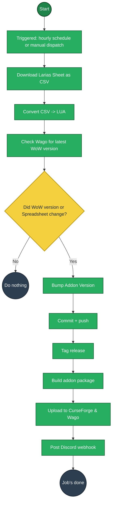

# Larias' Weekly Checklist

## Install

Pick whichever you prefer:

- **CurseForge / Wago** — click a badge above, then install and keep it updated through the CurseForge App or Wago App. This is the easiest option and handles updates automatically.
- **GitHub** — click the GitHub badge above to open the latest release, download the attached zip, and extract it into your WoW `Interface/AddOns/` directory. Updates are manual with this option.

## How releases are built

