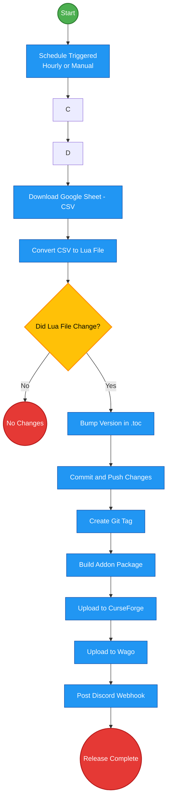

```mermaid
flowchart TD

    A((Start)):::start
    B[Schedule Triggered<br/>Hourly or Manual]:::process
    E[Download Google Sheet - CSV]:::process
    F[Convert CSV to Lua File]:::process
    G{Did Lua File Change?}:::decision

    H((No Changes)):::finish
    I[Bump Version in .toc]:::process
    J[Commit and Push Changes]:::process
    K[Create Git Tag]:::process
    L[Build Addon Package]:::process
    M[Upload to CurseForge]:::process
    N[Upload to Wago]:::process
    O[Post Discord Webhook]:::process
    P((Release Complete)):::finish

    A --> B --> C --> D --> E --> F --> G
    G -- No --> H
    G -- Yes --> I --> J --> K --> L --> M --> N --> O --> P

    classDef start fill:#4CAF50,color:#fff,stroke:#2E7D32,stroke-width:2px;
    classDef finish fill:#E53935,color:#fff,stroke:#B71C1C,stroke-width:2px;
    classDef process fill:#2196F3,color:#fff,stroke:#0D47A1,stroke-width:1px;
    classDef decision fill:#FFC107,color:#000,stroke:#FF8F00,stroke-width:2px;
```
