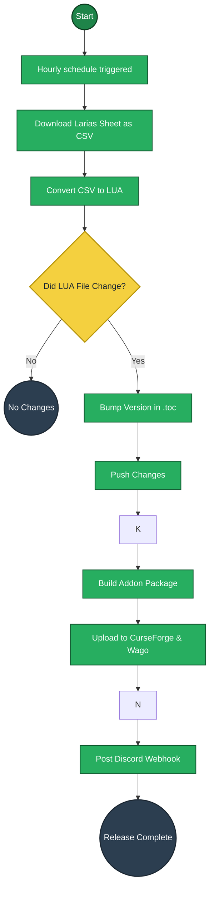

```mermaid
flowchart TD

    A((Start)):::start
    B[Hourly schedule triggered]:::process
    E[Download Larias Sheet as CSV]:::process
    F[Convert CSV to LUA]:::process
    G{Did LUA File Change?}:::decision

    H((No Changes)):::finish
    I[Bump Version in .toc]:::process
    J[Push Changes]:::process
    L[Build Addon Package]:::process
    M[Upload to CurseForge & Wago]:::process
    O[Post Discord Webhook]:::process
    P((Release Complete)):::finish

    A --> B --> E --> F --> G
    G -- No --> H
    G -- Yes --> I --> J --> K --> L --> M --> N --> O --> P

classDef start fill:#1E8449,color:#FFFFFF,stroke:#0B3D1F,stroke-width:2px;
classDef process fill:#27AE60,color:#FFFFFF,stroke:#145A32,stroke-width:1.5px;
classDef decision fill:#F4D03F,color:#1B2631,stroke:#B7950B,stroke-width:2px;
classDef finish fill:#2C3E50,color:#FFFFFF,stroke:#1B2631,stroke-width:2px;


```
