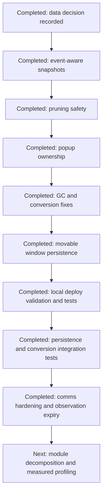

# Addon Review Notes

Review date: 2026-08-07

Scope: all first-party Lua modules, addon lifecycle and event paths, SavedVariables handling,
release automation, and the crest-conversion workflow. Bundled third-party libraries were not
reviewed as project-owned code.

## Decisions and completed work

### 1. Season 2 conversion item IDs

Status: reviewed, no change.

**Intent:** Preserve known-good Blizzard data even when it looks inconsistent by normal application
data standards.

**Why:** Item IDs are opaque identifiers, not ordered application-generated keys. Treating digit
length or neighboring values as a validity rule would create false positives and could break a
working merchant conversion.

**Preserved behavior:** The configured ID and exact merchant-link matching remain unchanged.

The unusual `26986` value in `crestConvertItemIDs` is intentional and is a valid Blizzard item
ID. Blizzard IDs are not guaranteed to have a uniform number of digits. Future validation must
therefore check configured IDs against authoritative game data or observed merchant links, not
reject IDs based on length or neighboring numeric patterns.

### 2. Tracking and snapshot performance

Status: fixed.

**Intent:** Reduce work triggered by frequent game events without weakening snapshot accuracy or
removing the richer tooltips and interactions available on the live character panel.

**Why:** Previously, every relevant event could query Great Vault, currencies, quests, gear slots,
tooltips, and item-upgrade APIs regardless of which data changed. Bursts were coalesced, but each
coalesced update still performed work outside the affected domain.

**Implementation choice:** Events are translated into `vault`, `gear`, and `currency` dirty flags.
Flags are merged while an update is queued. The snapshot is saved before live currency rendering so
gear-dependent crest calculations use the newly captured equipment. Great Vault rendering reuses
the snapshot just captured instead of querying the API a second time.

**Preserved behavior:** Calls without dirty-domain metadata still perform a full refresh. The live
currency renderer remains in use for the logged-in character because stored alt snapshots do not
carry all live tooltip and right-click metadata.

Tracking events now identify which snapshot domains are dirty:

- Great Vault events refresh vault and keystone data only.
- Equipment and inventory events refresh gear and currency data.
- Currency, bag, quest, and catalyst events refresh currency data only.
- Initial world entry and explicit refresh requests still perform a complete snapshot.

The live renderer now skips unaffected domains while retaining its richer currency tooltip and
interaction path. Event requests remain coalesced, so bursts produce one update with the union of
all dirty domains.

### 3. Saved-state pruning safety

Status: fixed.

**Intent:** Make pruning fail closed: data may remain longer than necessary, but valid user state
must never be deleted because source data is temporarily unavailable.

**Why:** The old code marked pruning complete before validating the dataset. An empty locale
registry could therefore be interpreted as a real dataset with no valid keys, causing all saved
checklist and collapse state to be removed.

**Implementation choice:** Require a non-empty list, at least one valid section, and at least one
valid item before authorizing deletion. Set the session marker only after validation succeeds so a
later call can retry.

**Preserved behavior:** Once valid data is available, obsolete item, section, and completion keys
are still pruned using the existing rules.

Pruning now requires a non-empty dataset containing at least one valid section and one valid item.
The once-per-session marker is written only after those checks pass. Missing or partially loaded
locale data therefore causes a retryable no-op instead of deleting checked, collapsed, or completed
SavedVariables.

### 4. Popup ownership

Status: fixed.

**Intent:** Give popup behavior one implementation and one set of private state.

**Why:** The root file and popup module both defined the same public methods. TOC load order caused
the later definitions to win silently, while both copies could retain separate local registries and
future fixes could be applied to the wrong copy.

**Implementation choice:** Keep the already modularized implementation in
`features/services/general/LariasWeeklyChecklist_Popups.lua` and remove the obsolete root-file copy.

**Preserved behavior:** The runtime-authoritative popup implementation was retained, including its
legacy theme-color compatibility handling. TOC order and all public method names remain unchanged.

Popup, modal, guide announcement, context-menu, theme-color definition, and full-reset code is now
owned only by `features/services/general/LariasWeeklyChecklist_Popups.lua`. The obsolete duplicate
implementation was removed from the root addon file, preventing method overwrites and independent
local popup state.

### 5. Forced garbage collection

Status: fixed.

**Intent:** Release addon-owned references on close without forcing a stop-the-world collection.

**Why:** `collectgarbage("collect")` requests a full Lua collection and can cause a visible frame
hitch. The addon already clears frame pools and runtime caches, which is the ownership work it can
perform reliably.

**Implementation choice:** Remove the delayed full-GC scheduler and keep the existing cache-release
calls. Memory reclamation is left to WoW's incremental collector.

**Preserved behavior:** Closing still hides floating panels, suspends tracking UI events, releases
list frames, and clears tracking and alt-summary runtime caches.

Closing the main window still releases list frames and runtime caches, but no longer schedules
`collectgarbage("collect")`. WoW's incremental Lua collector can reclaim released objects without
an addon-forced full-collection hitch.

### 6. Convert All cascading balances

Status: fixed.

**Intent:** Make "Convert All" describe and perform a true lowest-to-highest conversion chain while
remaining safe if merchant state or player balances change during execution.

**Why:** The old plan calculated each tier from its starting balance. Crests produced by an earlier
conversion were not included in later tiers, so the operation could stop before converting all
available currency. Immediate multi-purchase execution also assumed server state settled instantly.

**Implementation choice:** Copy and sort actions by source tier, simulate each balance change for
the confirmation plan, then execute purchases sequentially. Before every purchase, recheck the live
balance and merchant item link. A run token cancels delayed work when the merchant closes or changes,
and bounded retries allow newly produced currency time to settle.

**Preserved behavior:** Every purchase still uses Blizzard's existing `BuyMerchantItem` API and the
existing irreversible-action confirmation. Single-tier conversion buttons are unchanged.

**Follow-up review change:** The execution sequence now uses a testable state machine shared through
`CoreLogic`. It validates
the merchant item before reading balances, retries delayed currency settlement, clamps each purchase
to the live available amount, stops when its merchant run is cancelled, and refreshes the panel on
completion or a changed merchant action.

**Why this follow-up was needed:** The original unit tests covered only confirmation-plan arithmetic.
They could not detect regressions in timer retries, merchant closure cancellation, changed item links,
or the live purchase sequence used for an irreversible action.

### 7. Alt Summary position persistence

Status: fixed after in-game report.

**Intent:** Restore the standalone Alt Summary to the location where the user last dragged it.

**Why:** Dragging previously set only the frame's in-memory `_wasMoved` flag. No coordinates were
written to SavedVariables, so a UI reload recreated the frame at its default anchor.

**Implementation choice:** Register the frame with the bundled `LibWindow-1.1`, using account-wide
`altSummaryWin` storage. Restore only when saved coordinates exist so the first open can still anchor
to its invoking button. The existing full UI reset wipes the storage table and returns a live frame
to its default center position.

**Preserved behavior:** Alt Summary continues using the addon's global scale and opacity. Dynamic
first-open anchoring and the `_wasMoved` guard remain intact.

### 8. Remaining movable-window position persistence

Status: fixed after follow-up report.

**Intent:** Give every reusable addon-owned window the same reload-safe placement behavior.

**Why:** The currency configuration and crest conversion windows were movable, but their drag-stop
handlers only changed the live frame. Reloading the UI therefore returned them to their default
anchors. The main checklist, Alt Summary, and item-level reference window already persisted their
positions.

**Implementation choice:** Register the currency configuration and crest conversion frames with the
bundled `LibWindow-1.1`, each backed by a separate account-wide SavedVariables table. The currency
window's larger title drag bar explicitly saves through LibWindow as well as the frame's standard
drag handler. Restore runs only when saved coordinates exist, preserving each window's intended
first-use anchor. Full UI reset clears every reusable window's saved position, wiping LibWindow
tables in place, and immediately returns live windows to their defaults.

**Preserved behavior:** Confirmation, reminder, warning, and developer modals remain transient. They
share generic modal holders or represent unrelated alerts, so persisting their dragged positions
would unexpectedly transfer one dialog's placement to another.

**Follow-up review change:** The test suite loads the bundled `LibWindow-1.1`, executes its real
drag-stop save and restore path,
creates a second frame as a simulated reload, and calls the production full-reset method to verify
that reusable-window storage and live anchors are reset together.

**Why this follow-up was needed:** Earlier tests verified that window storage fields existed but did
not execute the behavior that had failed in game. Exercising the real library protects the complete
save, reload-style restore, and reset path rather than only its database schema.

### 9. Automated Lua quality gate and focused tests

Status: completed.

**Intent:** Prevent syntax, high-signal data-flow, and core decision-logic regressions from reaching
alpha or stable releases.

**Why:** The repository had no executable Lua checks. Runtime-only validation made malformed files
and subtle Lua semantics, especially collapsed multiple return values and shadowed forward
declarations, easy to miss until the addon was loaded in game.

**Implementation choice:** Keep validation entirely local and leave GitHub workflows unchanged.
`scripts/deploy_to_wow.ps1` uses the installed Lua 5.1 compiler to parse every first-party,
generated, and test Lua file; runs Luacheck across first-party source and tests; then runs the unit
and integration suite. All checks complete before any files are copied into WoW, and any failure
aborts deployment. Passing `-ValidateOnly` runs the same preflight without deploying. The Luacheck
baseline documents low-signal legacy exclusions for WoW globals,
callback arguments, intentional shadowing, and existing formatting while retaining
uninitialized-variable, never-set-variable, and accidental redefinition diagnostics.

**Follow-up review change:** Pure `CoreLogic` and the complete standalone test suite use the full
LuaCheck rule set without the legacy exclusions.

**Why this follow-up was needed:** The compatibility baseline suppresses several useful diagnostics
for legacy WoW-facing files. A strict boundary prevents undefined globals, dead assignments, unused
locals, and shadowing from silently entering new dependency-free logic and test code.

**Test coverage:** One hundred seven tests now run against production modules through a reusable WoW
API and frame mock. Coverage includes generated locale syntax; utility formatting, item-level, and
drag-reorder behavior; database initialization and character isolation; hidden-list management;
Alt Summary ordering; Great Vault block preferences; character selection; addon-message parsing,
throttling, and routing; event coalescing and partial snapshot refreshes; snapshot persistence;
weapon-upgrade configuration; crest tier detection, watermark discounts, and upgrade totals; Great
Vault activity grouping; season-key compatibility; footer notice priority and opacity; and bonus-roll
reminder gating; item-upgrade warning eligibility; LibWindow save, restore, and reset behavior; and
crest-conversion sequencing, retries, cancellation, and merchant validation. Selected production
modules are loaded directly by the tests, while shared pure decisions remain in `CoreLogic` so the
test path and runtime path use the same implementation.

**Harness intent:** `tests/wow_mock.lua` supplies only the deterministic WoW APIs and frame behavior
needed by each test. This keeps unit and integration coverage local, fast, and independent from a
running game client while making API assumptions explicit. It intentionally does not try to emulate
rendering, secure execution, combat lockdown, live Blizzard payload variations, or SavedVariables
serialization across an actual `/reload`; those remain in the manual in-game checklist below.

**Lint-driven fixes:** Rewrote guarded `GetItemInfo` and `UnitClass` calls so Lua preserves all return
values, restoring item quality/icon and player class-token reads. Corrected the tracked-currency
normalizer's forward declaration so its earlier closure calls the assigned implementation. Removed
an unused context-menu blocker that was declared and read but never created.

### 10. Remove local deploy timestamp metadata

Status: removed by request.

**Intent:** Remove the local deployment timestamp from runtime addon state and user-facing UI.

**Why:** The timestamp was development-only metadata that added a TOC-loaded module, deployment-time
file generation, watch-script normalization, a gear-popup footer value, and a developer-dump field.
It was not needed for addon behavior or release identification.

**Implementation choice:** Remove the metadata module and TOC entry, timestamp generation, UI and
dump consumers, locale string, and watch-deploy normalization. Local deployments retain only the
`-dev` version suffix, which still prevents development builds from being treated as live releases.
The deployment script removes an old deployed metadata file when encountered.

### 11. Addon-message hardening and observation expiry

Status: completed.

**Intent:** Prevent malformed or hostile addon messages from creating permanent update notices or
unnecessary processing.

**Why:** Messages arrive from other clients and were accepted with permissive field and version
parsing. A fabricated high version could remain in SavedVariables indefinitely, repeated senders had
no individual throttle, and date numbers in sheet labels could be mistaken for week numbers.

**Implementation choice:** Require an exact query or three-field version payload, cap message and
field lengths, accept only numeric live version components with optional build metadata, throttle
each sender, and timestamp accepted observations. Addon and spreadsheet observations expire after
14 days. Sheet parsing now prefers the explicit `Week N` value, so calendar dates in strings such as
`Week 5 - Apr 14` are not mistaken for the sheet week.

**Preserved behavior:** Valid live clients still exchange version and spreadsheet data over party,
raid, instance, and guild channels. Development and prerelease builds remain excluded from update
prompts and outbound live-version broadcasts.

### 12. Review document reconciliation

Status: completed.

**Intent:** Keep this file usable as an engineering record of what changed, why it changed, how it
was verified, and what risk remains.

**Why:** The previous draft duplicated the conversion summary under deployment metadata, contained
an awkward test-coverage sentence, overstated full production-module loading, and left completed
follow-up work in the remaining-risk roadmap.

**Implementation choice:** Remove the duplicated paragraph, distinguish selected production-module
tests from a complete WoW boot, update the suite count and coverage, and move persistence tests,
conversion execution, comm hardening, and strict lint into the completed roadmap.

## Remaining recommendations

1. Continue splitting the largest UI files by model, rendering, and interaction responsibility.
2. Expand strict LuaCheck coverage as WoW-facing modules gain explicit runtime-global declarations.
3. Profile event handlers in-game before introducing additional caches; optimize measured hot paths.

## Risk-ordered roadmap

## Manual in-game verification checklist

- Open the checklist and confirm Great Vault, currencies, gear tooltips, and right-click actions.
- Trigger currency and bag updates and confirm values refresh without changing gear/vault data.
- Equip an item and confirm upgrade costs and the alt snapshot update.
- Enter or update Great Vault content and confirm its grid and keystone refresh.
- Load with locale data unavailable in a test build and confirm SavedVariables remain intact.
- Open every modal, guide prompt, context menu, settings reset, and warning dialog.
- Drag the main, Alt Summary, item-level reference, currency configuration, and crest conversion
  windows; reload the UI and confirm each returns to its saved location.
- Run the full UI reset while movable windows are open and confirm they return to their defaults;
  reload once more and confirm the reset positions do not come back.
- At the crest merchant, compare Convert All confirmation totals with a manual cascading calculation.
- Close and reopen the main window repeatedly while profiling frame time and memory.
